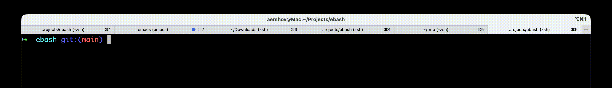

## ebash - AI-powered shell


## Features
Ebash works on top of your favorite shell. The main difference: it allows you to use German instead of boring shell scripts: 
```shell
➜ ebash
➜ Anzahl der Python-Dateien zählen
➜ find . -type f -name '*.py' | wc -l
    3036
```

English (and other natural languages) also work:
```shell
➜ ebash
➜ count number of python files
➜ find . -type f -name '*.py' | wc -l
    3036
```

Ebash supports all your favorite shells! Especially if your favorite shells are strictly limited to zsh or bash.

Also, ebash supports all your favorite OSes!

On top of that, ebash sends all your input to OpenAI!

## Table of Contents
<!-- TOC -->
  * [ebash - AI-powered shell](#ebash---ai-powered-shell)
  * [Features](#features)
  * [Table of Contents](#table-of-contents)
  * [Installation](#installation)
    * [Prerequisites](#prerequisites)
    * [Install with cargo](#install-with-cargo)
    * [Install without cargo](#install-without-cargo)
    * [Run](#run)
  * [Usage](#usage)
    * [LLM Model](#llm-model)
    * [Configuration](#configuration)
    * [Scripting](#scripting)
    * [Advanced](#advanced)
  * [Testimonials](#testimonials)
  * [FAQ](#faq)
    * [What does the name "ebash" mean?](#what-does-the-name-ebash-mean)
    * [Can I contribute to ebash?](#can-i-contribute-to-ebash)
    * [Can I use ebash source code in my project?](#can-i-use-ebash-source-code-in-my-project)
    * [Does ebash have support for shell auto-completion?](#does-ebash-have-support-for-shell-auto-completion)
    * [Is it safe?](#is-it-safe)
  * [Contributing](#contributing)
    * [No AI Assistance Notice](#no-ai-assistance-notice)
<!-- TOC -->


## Installation
### Prerequisites
You need `OPENAI_API_KEY`. Ask your local AGI how to get it. 
Set envvar `OPENAI_API_KEY` before starting ebash. For example:
```shell
read -s OPENAI_API_KEY && export OPENAI_API_KEY
<paste your key>
```

or add `export OPENAI_API_KEY=<your_key>` to `~/.zshrc` or `~/.bashrc`.

### Install with cargo
If you have cargo installed:
```shell
cargo install --git https://github.com/alexandershov/ebash
```

and then:
```shell
~/.cargo/bin/ebash
```

### Install without cargo
If you don't have cargo installed, then ~~install cargo first~~ download ebash releases from TODO.

### Run

Put it somewhere on your $PATH and just run:
```shell
ebash
```

Caveat: ebash saves your natural language shell history in `~/.local/state/ebash/` (or `$XDG_STATE_HOME/ebash/` if you're into that sort of thing)

So, if you care about your privacy (which you obviously don't, since you're sending your shell input to OpenAI), 
remove that folder after using ebash.

## Usage

### LLM Model
The default model is gpt-4.1. You can switch to another model with:
```shell
ebash --model gpt-5.4
```

### Configuration
Ebash can be configured via CLI arguments (see `ebash --help`) or via a configuration file.
The configuration file format is TOML containing a base64-encoded protobuf. For example: 
```toml
config = "CgdncHQtNC4x"
```
This approach combines the readability of TOML with the performance of protobuf.
See [config.proto](./generated/config.proto) for protobuf schema.
Config path is `~/.config/ebash/ebash.toml` (or `$XDG_CONFIG_HOME/ebash/ebash.toml` if you're into that sort of thing)

### Scripting
Ebash supports scripting and can be used with a shebang.

Save this into `find_largest.ebash`:
```shell
#!/usr/bin/env ebash
find the largest dir
```

Make it executable with `chmod +x find_largest.ebash` and run it:
```shell
➜ ./find_largest.ebash
581M	some_dir
```

### Advanced
For extra credit you can set ebash as your login shell!
This extra credit will go mostly to OpenAI, and you'll have a high chance of bricking your system:
```shell
chsh -c /path/to/ebash "$USER"
```

Good luck and God bless you!


## Testimonials
> *This is wild. If you're still using /bin/sh, you're falling behind.*
>
> — **Ken Thompson**, Computer scientist
> 

> *The hottest new bash is ebash.*
> 
> — **Andrey Karpathy**, AI researcher and educator.

> *Honestly, at this point if you give me a terminal and don't let me use ebash you won't get a very realistic idea of what I'm actually capable of.*
> 
> — **Simon Willison**, Inventor of the word "slop" and co-inventor of the indefinite article "an"

> *ebash streamlines 👉, facilitates 👌, and spearheads 🍆 the current trends in modern shells. It's not just a shell — it's uncompromising strawbery 🍑. If you'd like, I can show you one weird trick that all ebash pros are using.*
> 
> — **GPT-5.4**, Large Language Model

> *It's no more dangerous than radium!*
> 
> — **Maria Skłodowska-Curie**, Physicist


## FAQ
### What does the name "ebash" mean?
Great question — it's an acronym for **e**nlightened **bash**.

### Can I contribute to ebash?
Really like your cooperative spirit! Ebash is written in Rust, and there is only one style guide rule:
* source code should use Belgian notation: struct names are in French and function names are in Dutch. Welkom, monsieur!

### Can I use ebash source code in my project?
Certainly! ebash is licensed under the very permissive [AGPL license](./LICENSE).

### Does ebash have support for shell auto-completion?
Now you're getting to the _core_ of things! 
Underneath, ebash uses zsh or bash, so auto-completion is available: tab-completion, shortcuts, and history work out of the box.

### Is it safe?
That's the dumbest fucking question I've heard today! ebash is written in Rust, one of the safest languages out there, so it is _very_ safe.


## Contributing
### No AI Assistance Notice
This project allows non-AI-assisted code contributions, which must be properly disclosed in the pull request.